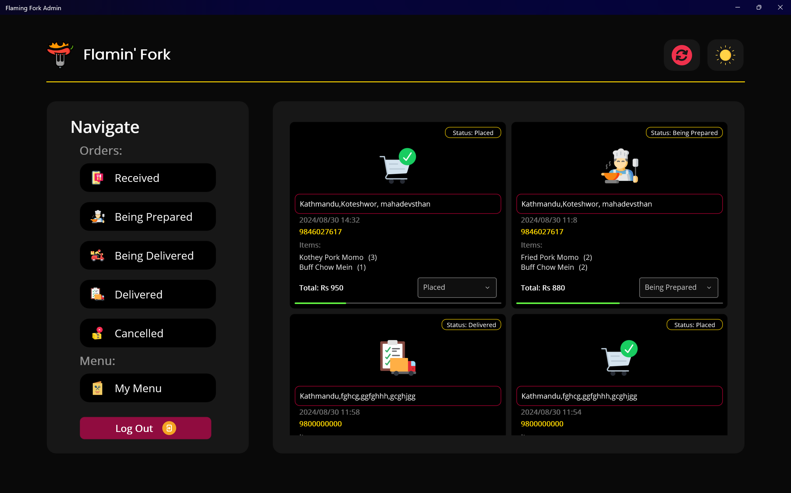

# Flaming Fork Admin 
- 'FlamingForkAdmin' is a admin side desktop application built for a supposed restaurant 'Flaming Fork' using .NET MAUI framework. The application lets the admin to view the orders received from its customers, change the status of those orders (placed, being prepared, being delivered, delivered).
- Additionally, it also lets the admin to make changes to the restaurant's menu i.e., add an item to the restaurant's menu, edit the details of an existing menu item or delete a particular item from the menu.
## Project Gallary

### Home Window

### Home Window(Dark)

### Received Orders

### Menu Window

### Add Menu Item

### Update Menu Item(Dark)

